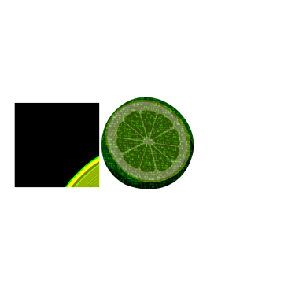

<p align="center">
  
</p>

## 👋 Introduction
Lime is a *cross-platform* library that is focused on game modding and tries to provide you with useful features for your journey.

## 🗒️ Features
- Detours
  - x86/x86-64
  - Lambda support
  - (Cross-Platform) Calling Convention support _(for lambdas!)_
- Instruction
  - Get next / prev instruction
  - Get immediates, displacement, size, mnemonic
  - Calculate absolute target _(follow relative instructions...)_
- Memory Pages
  - Allocate pages
    - Anywhere
    - Exactly at specified address
    - In ±2GB range of specified address
  - Read / Write / Restore protection
- Module
  - Iterate Loaded Modules
  - Iterate Symbols
  - Load Modules
- Address
  - Read / Write Data
- Signature Scanner
  - Supports Traditional & IDA Signatures
- Cross-Platform Entrypoint
- _[MinGW]_ Proxy-DLL Generation

> [!NOTE]  
> Lime follows `RAII` so you won't have to care about manually cleaning anything up (i.e. when allocating a page).

## ⚙️ Configuration

### Static Entrypoint
```cmake
set(lime_static_entrypoint ON)
```

> Default is: `OFF`

Use a platform-independent method for the entrypoint implementation.  
You do not need to enable this to make use of the cross-platform entrypoint!

### VirtualAlloc2
```cmake
set(lime_no_alloc2 ON)
```

> Default is: `OFF`

Can be used to disable the usage of `VirtualAlloc2`.  

~~This should be used for compatibility with wine as it currently does not support the `LowestStartingAddress` requirement.~~  
Should work since wine 8.11 🎉

# 📦 Installation

* Using [CPM](https://github.com/cpm-cmake/CPM.cmake)
  ```cmake
  CPMFindPackage(
    NAME           lime
    VERSION        5.0
    GIT_REPOSITORY "https://github.com/Curve/lime"
  )
  ```

* Using FetchContent
  ```cmake
  include(FetchContent)

  FetchContent_Declare(lime GIT_REPOSITORY "https://github.com/Curve/lime" GIT_TAG v5.0)
  FetchContent_MakeAvailable(lime)

  target_link_libraries(<target> cr::lime)
  ```

## 📖 Examples

https://github.com/Curve/lime/blob/7de073bd4736900193f6af5c543a3cf62e6f1a73/tests/hook.test.cpp#L46-L52
https://github.com/Curve/lime/blob/9ee66d3cc9e8976d5d8a40856d7ee5a09d32c415/tests/hook.test.cpp#L44-L52

> For more examples see [tests](tests/)

## 🌐 Who's using Lime

<div align="center">
<br/>


[profuis-patch](https://github.com/simplytest/profuis-patch)

</div>

> [Extend the list!](https://github.com/Curve/lime/issues/new)
