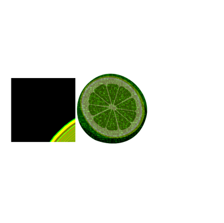

<p align="center">
  
</p>

## 👋 Introduction

Lime is a *cross-platform* library that is focused on game modding and tries to provide you with useful features for your journey.

## 🗒️ Features

- Detours
  - x86/x86-64
  - Lambda support
  - Cross-Platform Calling Convention support _(extendable!)_
- Instruction
  - Get next / prev[^1] instruction
  - Get immediates, displacement, size, mnemonic
  - Calculate absolute target _(follow relative instructions...)_
- Memory Pages
  - Allocate pages
    - Anywhere
    - Exactly at specified address
    - In ±2GB range of specified address
  - Update / Restore protection
- Libraries
  - Iterate Loaded Libraries
  - Iterate Symbols
  - Load Libraries
- Address
  - Read / Write Data
- Signature Scanner
  - Supports Traditional & IDA Signatures
- Cross-Platform Entrypoint
- _[MinGW]_ Proxy-DLL Generation

> [!NOTE]  
> Lime follows `RAII` so you won't have to care about manually cleaning anything up (i.e. when allocating a page).

[^1]: It is not possible to accurately determine the previous instruction, thus lime will return possible candidates. 

## ⚙️ Configuration

### Cross-Platform Entrypoint

```cmake
set(lime_entrypoint "Static" / "Platform")
```

> Default is: `Disabled`

# 📦 Installation

* Using [CPM](https://github.com/cpm-cmake/CPM.cmake)
  ```cmake
  CPMFindPackage(
    NAME           lime
    VERSION        7.0.0
    GIT_REPOSITORY "https://github.com/Curve/lime"
  )
  ```

* Using FetchContent
  ```cmake
  include(FetchContent)

  FetchContent_Declare(lime GIT_REPOSITORY "https://github.com/Curve/lime" GIT_TAG v7.0.0)
  FetchContent_MakeAvailable(lime)

  target_link_libraries(<target> cr::lime)
  ```

## 📖 Examples

```cpp
lime::make_hook(func, [](auto &hook, int param) { 
    return std::move(hook).reset()(param + 10); 
});

using enum lime::calling_convention;

lime::make_hook<int(void *), cc_fastcall>(0xDEADBEEF, [](auto &hook, void* self) { 
    return hook.original()(self); 
});
```

> For more examples see [tests](tests/)

## 🌐 Who's using Lime

<div align="center">
<br/>


[profuis-patch](https://github.com/simplytest/profuis-patch)

</div>

> [Extend the list!](https://github.com/Curve/lime/issues/new)
